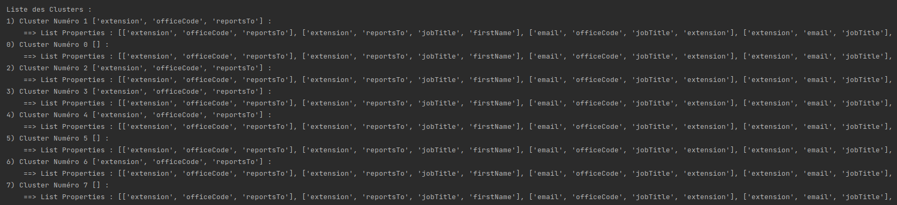

# Rapport mini-projet data mining

Alipio SIMOES, Paul-Elie VALLEE

## Objectif et choix de l'algorithme
Le but de ce projet est d'implémenter un algorithme de clustering pour pouvoir calculer les groupes d'instances similaires appartenant à la même classe.  
Nous avons décidé d'utiliser l'algorithme DBSCAN car il a plusieurs avantages :
- Il ne rentre pas dans le cluster les points considérés comme du bruit
- Il peut gérer les instances de taille différentes 
    - Ici les lignes sont de longueurs variables
- Nous avons bien compris son mode de fonctionnement en cours
    - L'implémentation est donc simplifiée

## Justification des paramètres utilisés
DBSCAN nécessite deux paramètres en plus des données : eps et min_samples, ici minPts.

`eps = 0.5`
epsilon est la distance maximum entre deux samples pour qu'ils soient considérés comme voisins. Il faut qu'il ne soit pas trop bas pour éviter de créer trop de clusters avec du bruit, mais pas trop haut non plus pour éviter de faire des clusters trop selectifs.

`min_samples = 4`
min_samples est le nombre minimum de voisins à avoir pour qu'un point soit considéré comme core.

Nous avons décidé de fixer ces valeurs à ces paramètres car après différents essais, ils s'avèrent être les plus optimaux.

## Interprétation des résultats obtenus
Après avoir converti le fichier `noSQL` en tableau 2D de string, et appliqué l'algorithme DBSCAN à ce dataset, nous avons trouvé une liste de **8 clusters**.

L'algorithme a donc attribué à chaque instance un numéro de cluster allant de 0 à 7.
Nous avons donc obtenu ce tableau.

`[1, 1, 1, 1, 1, 1, 1, 1, 1, 1, 0, 2, 2, 2, 2, 2, 2, 2, 2, 2, 2, 2, 2, 2, 2, 2, 2, 2, 2, 3, 3, 3, 3, 3, 3, 3, 3, 4, 4, 4, 4, 4, 4, 4, 4, 4, 4, 4, 5, 5, 5, 5, 5, 5, 5, 6, 6, 6, 6, 6, 6, 6, 6, 6, 6, 7, 0, 7, 7, 7, 7, 7, 7, 7, 7, 1, 1, 1, 1, 1, 1, 1, 1, 1, 1, 1, 1, 1, 2, 2, 0, 2, 0, 0, 2, 2, 2, 2, 2, 2, 2, 2, 3, 3, 3, 3, 3, 3, 3, 4, 4, 4, 4, 4, 0, 4, 5, 5, 5, 5, 5, 5, 5, 6, 6, 6, 6, 6, 6, 6, 0, 0, 0, 7, 7, 0, 7]`

En fonction de ce tableau, nous avons pu générer une liste de clusters avec pour chacun une liste de propriétés distinctes, et de propriétés communes. Nous avons donc pu trouver les noms de chacuns de ces clusters via la fréquence des propriétés présentes dans chacun d'entre eux.

Nous avons donc récupéré la liste des clusters suivant

Ce fichier noSQL est donc composé de 3 tables principales : 
- extension
- officeCode
- reportsTo